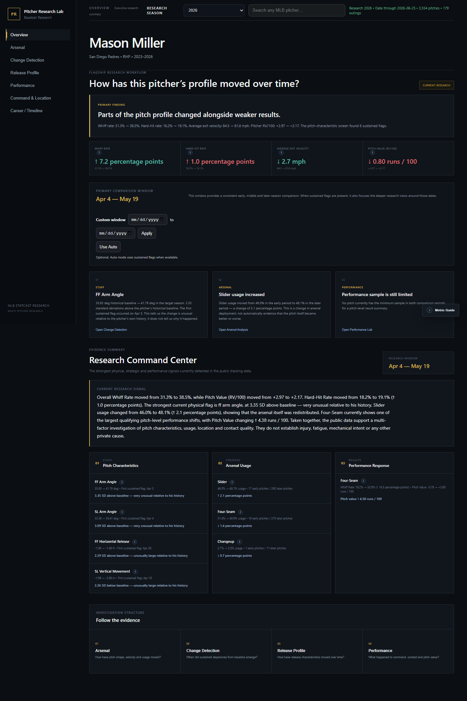
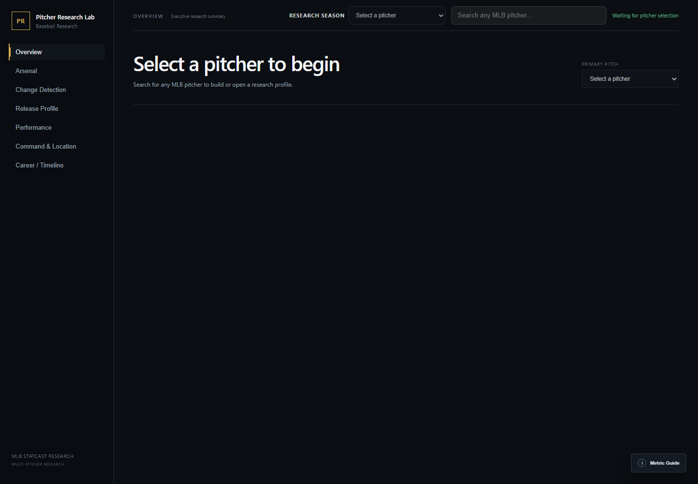
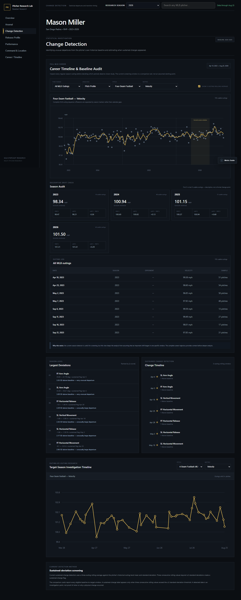
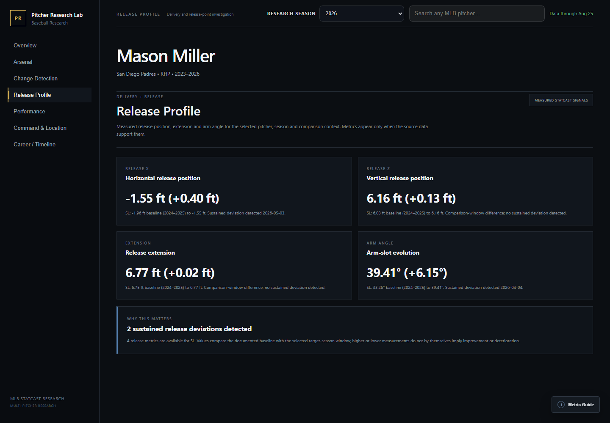

# Pitcher Research Lab

Pitcher Research Lab is a local MLB research application for studying how a pitcher's tracked profile moves over time. It establishes pitcher-specific context, screens for meaningful changes in either direction, and connects pitch characteristics with usage, release, location, hitter response, and results.


Pitcher Research Lab overview using live Mason Miller data

## What it does

Search for any MLB pitcher and the application resolves the player's MLB identity, downloads available public Statcast history, validates and caches it in SQLite, and prepares a research workspace. Previously cached pitchers update incrementally with a seven-day overlap so recent Statcast corrections can replace stored records without rebuilding the entire career.

## Why it exists

The project began with a Paul Skenes research question: could reported changes in his release and delivery profile be identified in public tracking data, and did measurable changes correspond with different results? That focused investigation became a reusable system for researching any MLB pitcher without assuming improvement, decline, or a mechanical cause.

## Research workflow

1. Search for an MLB pitcher by name.
2. The app resolves the MLBAM player ID and builds a local Statcast cache when needed.
3. Later launches refresh only new or recently corrected data.
4. Select any cached research season from the pitcher's available history.
5. Use pitcher-specific automatic periods or define explicit Baseline and Comparison periods from any cached career dates.
6. Compare pitch characteristics, arsenal usage, release information, location, hitter response and results.
7. Review the full career timeline before drawing conclusions about when a meaningful shift began.

The analysis is intentionally direction-neutral. A pitcher can improve, decline, remain stable, or show mixed signals. Large statistical departures are screening signals, not conclusions about cause.

New browser sessions open in a neutral state with no pitcher selected. Refreshing the same tab keeps the active pitcher, but the application never substitutes a hard-coded player.

## Application views

The landing state requires an intentional pitcher selection.

Neutral search-first landing screen

Change Detection places the selected season inside the pitcher's full cached MLB timeline and overlays an optional three-outing rolling average.

Change Detection using live Mason Miller data

Release Profile compares pitch-specific release measurements across the active baseline and comparison periods. Arm angle appears only when the source field is populated.

Release Profile using live Mason Miller data


## Research views

- **Overview** — summarizes the strongest current signals without assuming that movement is positive or negative.
- **Arsenal** — tracks velocity, movement, spin, extension and release characteristics by pitch type and season.
- **Change Detection** — compares the selected season with the pitcher's own prior history and screens for sustained departures.
- **Release Profile** — connects measurable release information with pitch-characteristic changes while keeping mechanical claims separate from tracking data.
- **Performance & Location** — compares whiffs, chase, hard contact, run value, pitch location and official game outcomes across research periods.
- **Career Audit** — places the selected research window inside the pitcher's complete cached MLB trajectory.

## Automated data pipeline

Pitch-level data are retrieved from Baseball Savant and cached in SQLite. The first load for a pitcher can take longer because the application builds the available Statcast history. Later updates use a seven-day overlap so recent Statcast corrections can be replaced cleanly without rebuilding the full career.

Official pitching lines are retrieved from MLB boxscores and cached separately. Selecting a historical research season can also populate official outings for that season when they are not already stored.

Downloads and validation finish before the write transaction begins. Transient Savant connection and server errors receive bounded retries. The database supports multiple pitchers in the same cache, records ingestion attempts in `ingest_runs`, and exposes `/api/health` for integrity and pipeline-status checks.

## Research controls

### Research season

The global **Research Season** selector changes the target year used by the analysis. Baselines, outing timelines, pitch profiles, research periods, location and performance views all follow the selected year.

### Baseline and comparison periods

Automatic mode uses up to two prior MLB seasons as the baseline and the selected research season as the comparison. If no prior MLB season exists, it compares earlier and later outings within the selected season. Custom mode accepts two explicit, non-overlapping periods from anywhere in the pitcher's cached MLB career.

The same inclusive dates propagate to Overview, Change Detection, Location, and Performance. Invalid, overlapping, reversed, incomplete, or out-of-coverage periods are rejected by both the interface and API. Automatic periods are not described as detected change points.

The screening score is `(comparison mean - baseline mean) / baseline outing standard deviation`. It is a descriptive baseline-standardized difference, not an inferential z-test, confidence level, formal change-point result, or causal claim.

## Metric definitions

| Measure | Definition |
|---|---|
| Movement | Statcast `pfx_x` and `pfx_z`, converted from feet to inches. Vertical movement is not labeled induced vertical break. |
| Usage | Pitch-type pitches divided by all pitches in the relevant sample. |
| Whiff rate | Swinging strikes divided by swings. |
| Zone rate | Pitches inside an internally normalized batter-specific zone divided by pitches with usable location and zone bounds. This is not an official leaderboard zone rate. |
| Heart rate | Pitches in the center half of both normalized zone axes divided by pitches with usable location. This is a project-specific location region, not an official Savant leaderboard field. |
| Edge rate | Located pitches inside the normalized zone and in its outer third on either axis, divided by pitches with usable location. This is a project-specific in-zone edge definition. |
| Chase rate | Swings outside that normalized zone divided by located pitches outside it. |
| Hard-hit rate | Batted balls at 95 mph or higher divided by tracked batted balls. |
| Expected wOBA allowed | Statcast estimated wOBA on tracked contact plus actual values for non-contact outcomes. This constructed measure may differ from an official leaderboard value. |
| Pitch value per 100 | Negative Statcast `delta_run_exp`, so positive values favor the pitcher, divided by pitches with a valid run-value field and scaled to 100. |

## Architecture

- `pitches` — pitch-level Statcast cache keyed by MLBAM pitcher ID and pitch identity.
- `pitchers` — player metadata and sync timestamps.
- `official_outings` — cached official MLB pitching lines.
- `ingest_runs` — ingestion history and failures.
- `schema.sql` — recreates the wide pitch-cache schema on a clean database.
- `schema_version` — records the initialized schema version.

The active application is pitcher-agnostic. The original one-player work is isolated under `case_studies/skenes/`.

`comparison.py` owns the shared Baseline/Comparison validation used by the research, location and performance APIs. The generated SQLite cache is excluded from version control and is created automatically on first launch.

## Technology

- Python, Flask, pandas, NumPy, and requests
- SQLite with schema initialization, integrity checks, indexes, and duplicate protection
- Browser-native JavaScript, HTML, CSS, and SVG visualizations
- `unittest`, pytest, and Playwright browser regression tests
- Windows launcher and GitHub Actions validation workflow

## Run on Windows

The easiest method is to double-click:

```text
START_HERE.bat
```

It creates the local virtual environment when necessary, installs the runtime dependencies, starts Flask and opens `http://127.0.0.1:5050`. The dedicated port prevents older local copies of the project from being mistaken for this build.

## Run from a terminal

```bash
python -m venv .venv
.venv\Scripts\activate
pip install -r requirements.txt
python app.py
```

## Updating cached pitchers

Refresh one pitcher:

```bash
python update_statcast.py <mlbam_id>
```

Refresh all pitchers already stored in the lab:

```bash
python update_all_pitchers.py
```

Sync official lines for a specific season:

```bash
python update_official_outings.py <mlbam_id> --season 2025
```

`run_daily_update.bat` can be attached to Windows Task Scheduler if a recurring refresh is useful.

## Validation and tests

Run the built-in project validator:

```bash
python validate_project.py
```

It checks Python syntax, JavaScript syntax when Node is installed, SQLite integrity, duplicate pitch identities and generalized frontend-route safeguards.

For the full regression suite:

```bash
pip install -r requirements-dev.txt
python -m playwright install chromium
pytest -q
```

The regression suite uses deterministic temporary databases and does not depend on a packaged player cache or live network access. It covers multiple pitcher shapes, explicit career periods, corrected overlap updates, duplicate replacement, malformed ingestion, retries, rollback, metric definitions, neutral startup and mobile overflow. Unsupported samples are expected to return a clear empty/error state instead of a server crash.

## API examples

```text
GET  /api/health
GET  /api/pitchers/search?q=Tarik%20Skubal
GET  /api/pitchers/<mlbam_id>/meta?season=2025
POST /api/pitchers/<mlbam_id>/sync
GET  /api/pitchers/<mlbam_id>/changes?season=2025
GET  /api/pitchers/<mlbam_id>/timeline?season=2025
GET  /api/pitchers/<mlbam_id>/pitch/FF?season=2025
GET  /api/pitchers/<mlbam_id>/research?season=2025&baseline_start=2024-04-01&baseline_end=2024-09-28&comparison_start=2025-04-01&comparison_end=2025-07-15
GET  /api/pitchers/<mlbam_id>/location?season=2025&pitch=FF&hand=R
GET  /api/pitchers/<mlbam_id>/performance?season=2025
GET  /api/pitchers/<mlbam_id>/career?season=2025
```

The production API exposes only pitcher-scoped routes. Player-specific prototype code remains isolated under `case_studies/`.

## Paul Skenes case study

The project was prompted by 2026 reporting on Paul Skenes that discussed changes in his delivery and release position. The initial version tested whether public tracking data could identify and quantify those changes. The current application keeps that origin story while allowing the same research workflow to be used on other pitchers and seasons without changing code.

See `case_studies/skenes/README.md` for the original research context and source articles.

## Limitations

Pitcher Research Lab describes public tracking data. It does not establish injury, fatigue, mechanical intent or causation. Release position, velocity, movement, spin, extension, command and outcomes can be measured and compared directly; mechanical explanations should be supported with appropriate video or other evidence.

Pitch classifications and public tracking fields can be corrected, missing or unavailable for older observations. Results should always be interpreted with the displayed sample and data-coverage context.

## Data sources

- [MLB Stats API](https://statsapi.mlb.com/) for player identity and official game lines
- [Baseball Savant Statcast Search](https://baseballsavant.mlb.com/statcast_search) for public pitch-level tracking data

This is an independent research project and is not affiliated with or endorsed by Major League Baseball.
